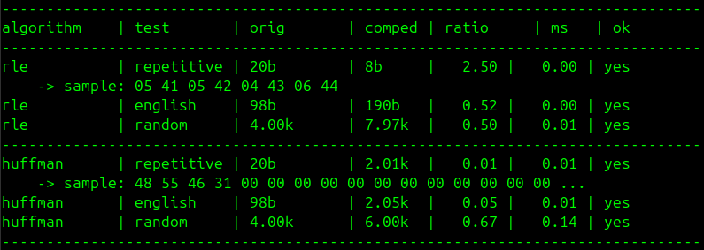

# compression-algos

A lightweight C project for implementing, testing, and comparing data compression algorithms.  
Each compression algorithm is implemented as an isolated module that follows a common `Compressor` interface, making it easy to study, benchmark, and extend the collection.

The project includes a small test harness that runs every registered algorithm against several input datasets and verifies correctness by decompressing the output and comparing it to the original data.

---

## Implemented and Planned Algorithms

| Algorithm                            | Category                  | Status | Notes                                                 |
| ------------------------------------ | ------------------------- | :----: | ----------------------------------------------------- |
| Run-Length Encoding (RLE)            | Simple / Statistical      |   🗹    | Byte-oriented RLE implementation.                     |
| Huffman Coding                       | Entropy Coding            |   🗹    | Frequency-table header with bit-packed output stream. |
| Shannon–Fano Coding                  | Entropy Coding            |   🗹    | Educational prefix coding algorithm.                  |
| Canonical Huffman Coding             | Entropy Coding            |   🗹    | Compact codebook representation.                      |
| Adaptive Huffman (FGK)               | Entropy Coding            |   🗹    | Streaming Huffman coding without a header.            |
| Arithmetic Coding                    | Entropy Coding            |   ☐    | Range-based entropy coding.                           |
| Range Coding                         | Entropy Coding            |   ☐    | Arithmetic coding variant.                            |
| ANS (rANS / tANS)                    | Entropy Coding            |   ☐    | Modern entropy coding family.                         |
| Elias Gamma Coding                   | Integer Coding            |   ☐    | Universal integer encoding scheme.                    |
| Elias Delta Coding                   | Integer Coding            |   ☐    | Extension of gamma coding.                            |
| Fibonacci Coding                     | Integer Coding            |   ☐    | Integer coding using Fibonacci representation.        |
| LZ77                                 | Dictionary                |   ☐    | Sliding-window dictionary compression.                |
| LZ78                                 | Dictionary                |   ☐    | Dictionary-building compression algorithm.            |
| LZW                                  | Dictionary                |   ☐    | Widely known variant used in formats like GIF.        |
| DEFLATE                              | Hybrid                    |   ☐    | Combination of LZ77 and Huffman coding.               |
| LZMA / LZMA2                         | Dictionary + Range Coding |   ☐    | High-ratio compression used by modern archivers.      |
| Snappy                               | Fast Compression          |   ☐    | Focus on speed rather than compression ratio.         |
| Zstandard (Zstd-like)                | Hybrid                    |   ☐    | Modern high-performance compression algorithm.        |
| Burrows–Wheeler Transform (BWT)      | Transform                 |   ☐    | Often used as preprocessing before entropy coding.    |
| Move-to-Front (MTF)                  | Transform                 |   ☐    | Typically used after BWT.                             |
| Delta Encoding                       | Transform                 |   ☐    | Useful for numerical or structured data.              |
| Prediction by Partial Matching (PPM) | Context Modeling          |   ☐    | Statistical compression based on context prediction.  |
| Block-sorting pipeline (bzip2-style) | Transform + Entropy       |   ☐    | BWT + MTF + entropy coding.                           |
| Bit Packing                          | Data Packing              |   ☐    | Fixed-width integer packing.                          |
| Custom / Experimental Algorithms     | Various                   |   ☐    | Placeholder for additional research or experiments.   |

---

## Quick Start

Build the project:

```bash
make
```

Run the demonstration program:

```bash
./compressor
```

The program will automatically run all registered algorithms and display a summary including:

- original size
- compressed size
- compression ratio
- runtime
- correctness verification



---

## Project Structure

```
compression-algos/
├── include/
│   └── compressor.h
│
├── src/
│   ├── main.c
│   └── registry.c
│
├── algorithms/
│   ├── rle/
│   │   ├── rle.c
│   │   └── rle.h
│   │
│   └── huffman/
│       ├── huffman.c
│       └── huffman.h
│
├── Makefile
├── LICENSE
└── README.md
```

---

## Adding a New Algorithm

1. Create a new directory under `algorithms/`.

Example:

```
algorithms/lz77/
```

2. Implement the `Compressor` interface defined in `include/compressor.h`.

Example:

```c
Compressor lz77_compressor = {
    .name = "lz77",
    .compress = lz77_compress,
    .decompress = lz77_decompress
};
```

3. Register the algorithm in `src/registry.c`.

4. Add the new source file to the `Makefile`.

5. Rebuild the project:

```bash
make
```

---

## Goals

- Provide clean reference implementations of classical compression algorithms.
- Allow easy comparison between algorithms.
- Make adding new algorithms straightforward through a modular architecture.
